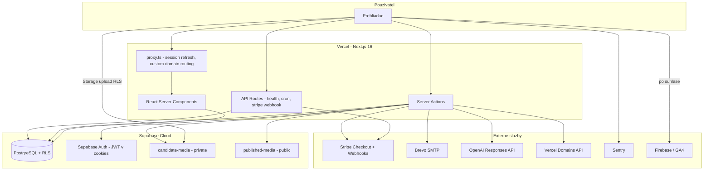
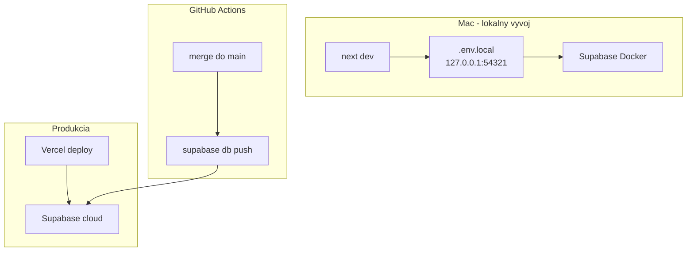
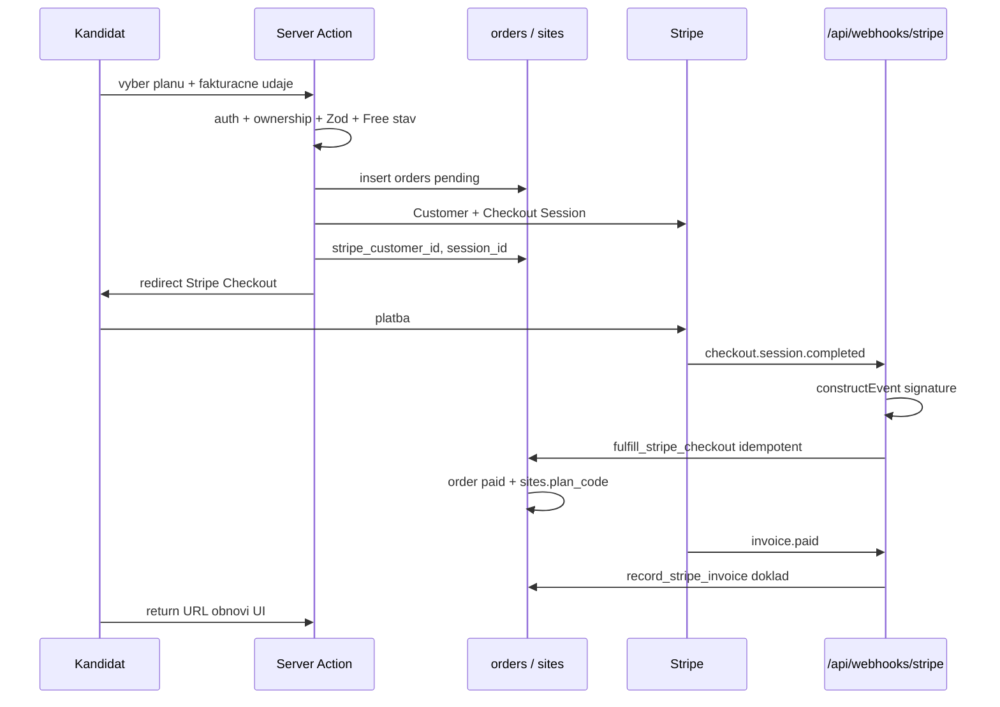

# Data Flow Map — WebPreKandidata.sk

**Dátum auditu:** 12. august 2026  
**Rozsah:** Read-only analýza kódu, migrácií `0001`–`0024`, architektúry a konfigurácie.  
**Súvisiace dokumenty:** [SECURITY_AUDIT_REPORT.md](./SECURITY_AUDIT_REPORT.md), [PRODUCTION_READINESS.md](./PRODUCTION_READINESS.md), [ARCHITECTURE.md](./ARCHITECTURE.md)

---

## 1. Architektúra aplikácie

### 1.1 Tok požiadavky



### 1.2 Technologická mapa

| Vrstva | Technológia | Poznámka |
|--------|-------------|----------|
| Frontend | Next.js 16, React 19, TypeScript, TipTap, Lucide | RSC predvolene; Client Components len pre interakciu |
| Backend | Server Actions + Route Handlers | Node.js 24 na Verceli; žiadny samostatný API server |
| Auth | Supabase Auth (`@supabase/ssr`) | Session cookies; deferred email verification cez app tokeny |
| Databáza | PostgreSQL (Supabase) | RLS na všetkých tabuľkách; RPC `SECURITY DEFINER` |
| Storage | Supabase Storage | `candidate-media` (private), `published-media` (public) |
| Platby | Stripe Checkout (one-time) | Webhook fulfillment cez `service_role` RPC |
| E-mail | Brevo SMTP (nodemailer) | Auth, overenie, kontakt, podpora |
| AI | OpenAI Responses API | `store: false`, Structured Outputs |
| Hosting / CDN | Vercel | Apex + custom domény cez Vercel Domains API |
| Cron | Vercel Cron → `GET /api/cron/retention` | Denne 03:17 UTC |
| Monitoring | Sentry (client / server / edge) | `sendDefaultPii: false` |
| Analytics | Firebase / GA4 | Consent-gated; measurement ID `G-0LPPHZCVXB` |
| Build / CI | `npm run build`, GitHub Actions | Migrácie: `.github/workflows/supabase-migrate.yml` |
| Lokálny vývoj | Docker Supabase `:54321` | Demo režim bez externých služieb |

**Background joby / queue:** Žiadny dedikovaný queue systém (Redis, Bull, atď.). Jediný plánovaný job je retenčný cron. Stripe webhooky sú event-driven.

**Runtime:** Vercel Serverless / Edge (proxy). Produkčný projekt `beewoy/webprekandidata`, Node.js 24.

### 1.3 Deployment a prostredia



| Prostredie | Databáza | Credentials |
|------------|----------|-------------|
| Lokálny vývoj | Docker Supabase `:54321` | `.env.local` (nikdy `*.supabase.co`) |
| Demo bez DB | Žiadna (in-memory fallback) | `DEMO_MODE=true` alebo chýbajúce Supabase env |
| Produkcia | Cloud Supabase `iozvohajbtzxviytpufp` | Vercel env + GitHub Secrets |

**Zero prod from Mac:** vývojár nespúšťa `supabase link`, `supabase db push` ani `supabase config push` proti produkcii.

---

## 2. Databázový model

Zdroj: migrácie `supabase/migrations/0001`–`0024`. Všetky tabuľky majú RLS enabled. Migrácia `0019` dopĺňa table-level GRANTy pre API role pri zachovaní REVOKE na `payment_events` a `email_verification_tokens`; prístup riadi RLS. Migrácia `0023` uzamyká `sync_domain_provider_state` na `service_role` a pridáva `rate_limit_buckets`. Migrácia `0024` pridáva `orders.order_number` a `confirmation_email_sent_at`.

### 2.1 Prehľad tabuliek

| Tabuľka | Účel | Vlastníctvo | Citlivé údaje | Hlavné riziko |
|---------|------|-------------|---------------|---------------|
| `profiles` | Profil a rola | `id = auth.uid()` | `full_name`, `role`, `email_verified_at` | Eskalácia role — RLS UPDATE limituje na `full_name` a `role='candidate'` |
| `sites` | Kandidátsky projekt | `owner_user_id → profiles` | meno, lokalita, slug, `plan_code`, `admin_hold*` | IDOR — chránené `owns_site()` |
| `site_drafts` | Nepublikovaný koncept | cez `site_id` | JSON `content`/`theme`/`seo` (kontakt, bio) | Únik draftu — RLS len owner; verejný web nesmie čítať |
| `site_publications` | Nemenné snapshoty | cez `site_id` | obsah, media_manifest, posts | Verejný read cez app `service_role`, nie anon RLS |
| `media_assets` | Metadata médií | `site_id` + `owner_user_id` | `storage_path`, alt, caption | Soft-delete bez purge |
| `domains` | Subdomény a custom | cez `site_id` | hostname, DNS/SSL metadata | Owner môže cez RPC nastaviť `active` (pozri audit) |
| `orders` | Objednávky / entitlement | `user_id` + `site_id` | buyer/seller snapshot, `order_number`, Stripe IDs / Invoice URL | Zápis len `service_role` RPC |
| `payment_events` | Webhook idempotencia | platforma | `provider_event_id`, payload ref | REVOKE ALL pre klientov |
| `posts` | Aktuality | cez `site_id` | title, body HTML, excerpt | Soft-delete; `cover_asset_id` bez same-site CHECK |
| `contact_submissions` | Kontaktný formulár | cez `site_id` | meno, email, správa | 90-dňová retencia |
| `ai_generations` | AI audit / kvóta | `user_id` + `site_id` | fingerprint, tokeny, model | Bez promptu; 90 dní; `target_id` bez FK |
| `audit_logs` | Prevádzkový audit | platforma | action, metadata | Admin read; bez retencie |
| `email_verification_tokens` | Hashované overovacie tokeny | `user_id` | `token_hash` (SHA-256) | REVOKE ALL; bez purge jobu |
| `draft_revision_cooldowns` | Cooldown po revision conflicte | cez `site_id` | `conflict_until`, `last_revision` | REVOKE ALL pre klientov; len SECURITY DEFINER RPC |
| `rate_limit_buckets` | DB rate limiting | platforma | `bucket_key`, `hit_count` | Iba `consume_rate_limit` (service_role) |

### 2.2 Detail tabuliek

#### `profiles`
- **FK:** `id → auth.users(id) ON DELETE CASCADE`
- **Účel:** 1:1 profil; `role` = `candidate` | `admin`
- **Prístup:** SELECT vlastný alebo admin; UPDATE iba `full_name` (column grant)
- **Retencia:** počas účtu; cascade pri mazaní auth usera

#### `sites`
- **FK:** `owner_user_id → profiles`; `current_publication_id → site_publications`; `admin_hold_by → profiles`
- **Účel:** tenant root projektu
- **Soft delete:** `deleted_at` (bez automatického purge)
- **Poznámka:** `plan_code` nie je samo o sebe oprávnením — entitlement ide cez `orders`

#### `site_drafts`
- **FK:** `site_id → sites ON DELETE CASCADE`; `updated_by → profiles`
- **Účel:** editor state; **nikdy** nesmie byť čítaný verejným webom
- **Optimistic locking:** `revision`

#### `site_publications`
- **FK:** `site_id → sites ON DELETE RESTRICT`; `published_by → profiles`
- **Účel:** immutable snapshot (content, theme, seo, posts, media_manifest, fingerprint)
- **RLS:** owner SELECT only; zápis cez publish RPC

#### `media_assets`
- **FK:** `site_id → sites CASCADE`; `owner_user_id → profiles`
- **Kinds:** logo, party_logo, hero, about, social, post, gallery
- **Storage path:** `{siteId}/{assetId}/...` — Storage RLS cez `owns_site()`

#### `domains`
- **FK:** `site_id → sites CASCADE`
- **Typy:** subdomain (rezervácia), custom (Plus)
- **Mutácie:** len RPC (`attach_custom_domain`, `sync_domain_provider_state`, …)

#### `orders`
- **FK:** `site_id → sites RESTRICT`; `user_id → profiles RESTRICT`
- **Constraint:** `total_cents IN (4999, 8999)`; `currency = EUR`
- **Citlivé:** `buyer_snapshot`, `seller_snapshot`, Stripe customer/session/invoice URL
- **`valid_until`:** nullable (produktové pravidlo)

#### `payment_events`
- **FK:** žiadne
- **Účel:** idempotencia podľa `provider_event_id`
- **Prístup:** iba `service_role`

#### `posts`
- **FK:** `site_id → sites CASCADE`; `author_user_id → profiles`; `cover_asset_id → media_assets SET NULL`
- **Medzera:** žiadny CHECK, že cover patrí tomu istému `site_id`
- Soft delete: `deleted_at`

#### `contact_submissions`
- **FK:** `site_id → sites CASCADE`
- **Retencia:** `retention_expires_at` default `now() + 90 days`
- Telefón sa do DB neukladá (iba v odoslanom e-maile)
- Insert: `service_role` (server action)

#### `ai_generations`
- **FK:** `site_id`, `user_id`; **`target_id` bez FK** na `posts`
- Ukladá fingerprint, nie prompt ani odpoveď
- Retencia 90 dní

#### `audit_logs`
- **FK:** `actor_user_id`, `site_id` (SET NULL)
- Admin SELECT cez RLS `is_platform_admin()`
- Bez retenčnej politiky

#### `email_verification_tokens`
- **FK:** `user_id → profiles CASCADE`
- Token v DB len ako SHA-256 hash; 24h expirácia
- Issuance: `service_role` only; verify: anon/authenticated RPC

#### `draft_revision_cooldowns`
- **FK:** `site_id → sites ON DELETE CASCADE`
- **Účel:** 5-sekundový cooldown po `revision_conflict` v `update_site_section` (migrácie `0021`/`0022`)
- **Prístup:** žiadny priamy klientsky prístup (`REVOKE ALL`); iba SECURITY DEFINER RPC
- **Citlivosť:** nízka (technický rate/storm guard, nie PII)

### 2.3 Storage buckety

| Bucket | Public | MIME | RLS | Účel |
|--------|--------|------|-----|------|
| `candidate-media` | nie | jpeg/png/webp, max 15 MiB | owner cez `owns_site(path site_id)` | Draft médiá |
| `published-media` | áno | webp | žiadne object policies (zámer) | Immutable publikované médiá |

Cesta published: `{siteId}/{publicationId}/{assetId}.webp`.

### 2.4 Ownership a IDOR model

```text
auth.uid()
  → profiles.id
  → sites.owner_user_id
  → site_drafts / media / posts / domains / orders (cez site_id alebo user_id)
```

Každá mutácia musí overiť reláciu na serveri **a** RLS/RPC. Verejný web číta len `sites.status = published` + aktuálny snapshot cez serverový klient — nie `site_drafts`.

### 2.5 Retencia — súhrn

| Dáta | Politika | Automatický purge |
|------|----------|-------------------|
| `contact_submissions` | 90 dní | `purge_expired_operational_data` cez cron |
| `ai_generations` | 90 dní | rovnaký cron |
| `email_verification_tokens` | 24h expiry | **nie** |
| `audit_logs` | neurčená | **nie** |
| Soft-deleted sites/posts/media | `deleted_at` | **nie** |
| `site_publications` | história verzií | **nie** |
| `orders` / `payment_events` | účtovná / forenzná | **nie** (očakávané) |

---

## 3. Authentication a session flow

```text
Registrácia
  → Zod validácia
  → Supabase signUp (okamžitá relácia; enable_confirmations=false)
  → redirect /app?welcome=1
  → service_role issue token (SHA-256) + Brevo e-mail
  → /auth/overit-email?token=… → verify_email_token → profiles.email_verified_at

Login
  → Zod → Supabase signInWithPassword → session cookies (SSR)

Obnova hesla
  → reset e-mail (Supabase Auth cez Brevo SMTP)
  → /auth/callback?code=…&next=/obnova-hesla
  → updateUser(password) → logout → /prihlasenie

Logout
  → signOut + cookie clear
```

**Session:** Supabase JWT v cookies; obnovu rieši `proxy.ts` cez `getClaims()`.  
**Zdroj pravdy overenia e-mailu:** `profiles.email_verified_at` (nie `auth.users.email_confirmed_at`).  
**Poznámka:** Overenie e-mailu je v MVP advisory (banner); checkout/publish ho z kódu nevynucujú — pozri SECURITY_AUDIT_REPORT.

---

## 4. Platobný tok (Stripe)



- Ceny: Basic 4999 / Plus 8999 centov — z env Price ID + DB constraint, nie z klienta.
- Aktivácia balíka **nikdy** z return URL ani z `invoice.paid`.
- Demo režim Checkout nevolá.
- Fail-closed: `isStripeConfigured()` vyžaduje live secret, webhook secret, ceny, `SELLER_*`, `LEGAL_DOCUMENTS_APPROVED=true`.

---

## 5. Publikovanie a verejný web

```text
draft + published posts + active media
  → ownership + has_publish_entitlement
  → copy media → published-media/{siteId}/{publicationId}/
  → publish_candidate_site RPC
  → site_publications snapshot + sites.current_publication_id
  → revalidate /:slug
```

Custom domain (Plus): attach → Vercel Domains API → DNS verify → `proxy.ts` rewrite Host → `/{slug}`.

---

## 6. GDPR dátový katalóg

| Údaj | Kde vzniká | Kde sa ukladá | Kto má prístup | Komu sa posiela | Odporúčaná retencia | Nevyhnutný? |
|------|------------|---------------|----------------|-----------------|---------------------|-------------|
| E-mail účtu | registrácia | `auth.users` | user, admin, Supabase | Brevo (auth/verify) | počas služby + zákonné | áno |
| Meno | registrácia / profil | `profiles.full_name` | user, admin | — | počas služby | áno |
| Heslo | registrácia | Supabase Auth (hash) | nikto v app | — | počas účtu | áno |
| Fakturačné údaje | checkout | `orders.buyer_snapshot`, Stripe Customer | owner, admin, Stripe | Stripe | účtovná lehota (SK) | áno pri platbe |
| Seller snapshot | server env | `orders.seller_snapshot` | owner (read), admin | Stripe Invoice footer | účtovná | áno |
| Stripe IDs | Checkout/webhook | `orders`, `payment_events` | service_role / owner read | Stripe | účtovná / forenzná | áno |
| Obsah kandidáta | editor | `site_drafts`, `site_publications` | owner; po publish verejnosť | CDN/Storage | počas kampane + snapshoty | áno |
| Fotografie | upload | Storage + `media_assets` | owner; published public | Vercel/CDN | soft-delete bez purge | áno |
| Kontaktná správa | verejný formulár | `contact_submissions` | site owner, admin | Brevo → kandidát | 90 dní (implementované) | áno (účel) |
| Telefón návštevníka | kontaktný formulár | **nie v DB** | — | iba v e-maile | ephemeral | voliteľný |
| Support správa | dashboard | Brevo inbox | prevádzkovateľ | Brevo | podľa e-mailovej politiky | áno |
| AI fingerprint | onboarding/článok | `ai_generations` | user, admin | OpenAI (runtime, store=false) | 90 dní | prevádzkový |
| AI vstup (text) | onboarding/článok | **nie trvalo v DB** | — | OpenAI API | session u providera | voliteľný |
| Audit metadata | publish, admin, AI rate | `audit_logs` | admin | — | neurčená — riziko | áno (bezpečnosť) |
| GA cookies | súhlas | prehliadač + Google | Google | Google | podľa GA nastavenia | nie (súhlas) |
| Session cookies | login | prehliadač | browser | Supabase | session lifetime | áno |
| IP / request | hosting | Vercel logs | Vercel, prevádzkovateľ | — | podľa Vercel | prevádzkový |
| Sentry events | chyby | Sentry | prevádzkovateľ | Sentry | podľa Sentry projektu | prevádzkový |

### 6.1 Právne základy (zjednodušene)

| Účel | Základ |
|------|--------|
| Účet, editor, publikovanie, platba | plnenie zmluvy |
| Overenie e-mailu, bezpečnosť, audit | oprávnený záujem / zmluva |
| Účtovné doklady | zákonná povinnosť |
| Analytics (GA4) | súhlas |
| AI návrhy | zmluva + súhlas s odoslaním vstupu |

Právne dokumenty (`/obchodne-podmienky`, `/ochrana-sukromia`, …) sú pracovné znenie; produkčné zverejnenie viazané na `LEGAL_DOCUMENTS_APPROVED=true`.

---

## 7. Externí poskytovatelia

| Poskytovateľ | Údaje | Osobné údaje | Účel | Mimo EÚ/EHP | GDPR riziko |
|--------------|-------|--------------|------|-------------|-------------|
| **Vercel** | HTTP traffic, build/runtime logs, env | možné IP, URL | hosting, CDN, cron, Domains API | USA (typicky) — DPA potrebné | stredné |
| **Supabase** | DB, Auth, Storage, RLS | áno — jadro PII | databáza, auth, súbory | **vyžaduje manuálne overenie regiónu** projektu | vysoké |
| **Stripe** | Customer, Checkout, Invoice, webhook | áno — fakturácia | platby | USA — SCC / DPA | stredné |
| **Brevo** | e-mailové správy, SMTP | áno — e-mail, meno, správa | doručovanie | Francúzsko / EÚ | nízke |
| **OpenAI** | AI vstupy (bio, brief) | možné | AI onboarding a články | USA — DPA/SCC **vyžaduje manuálne overenie** | vysoké |
| **Google / Firebase** | GA4 events, cookies | pseudonymizované | meranie návštevnosti | USA | stredné (súhlas) |
| **Sentry** | stack traces, pathname, digest | možné | error tracking | USA — DPA | stredné |
| **Websupport** | DNS, pošta domény | nie (DNS) / pošta | DNS, mail auth | SK / EÚ | nízke |

**SMS:** nepoužíva sa.  
**Dedikovaný CDN mimo Vercel:** nie (Vercel edge + Supabase Storage public URLs).

---

## 8. Admin a interné prístupy

| Položka | Stav |
|---------|------|
| Admin role | `profiles.role = 'admin'` — nastavenie mimo UI cez SQL |
| Routy | `/admin`, `/admin/pouzivatelia`, `/admin/weby`, `/admin/weby/[siteId]`, `/admin/objednavky`, `/admin/domeny`, `/admin/ai-pouzitie`, `/admin/audit` |
| Guard | `requirePlatformAdmin()` v layoute + RPC `is_platform_admin()` |
| Mutácie | `setAdminSiteHoldAction`, `grantAdminSitePlanAction` |
| Demo | admin panel nedostupný |
| Seed / test heslá v kóde | **žiadne** default admin heslá v repozitári |
| Debug | `/api/health` (minimálny); demo cesty `/ukazka` a `/ukazka/{slug}` (verejné ukážky šablón); prehľad `/sablony` |

---

## 9. Secrets a konfigurácia (mapa)

| Premenná | Scope | Účel |
|----------|-------|------|
| `NEXT_PUBLIC_SUPABASE_URL` | client | Supabase endpoint |
| `NEXT_PUBLIC_SUPABASE_PUBLISHABLE_KEY` | client | anon key |
| `SUPABASE_SERVICE_ROLE_KEY` | server | admin klient, tokeny, webhooky, cron |
| `NEXT_PUBLIC_APP_URL` / `ROOT_DOMAIN` | client | URL platformy |
| `DEMO_MODE` | server | demo bypass |
| `LEGAL_DOCUMENTS_APPROVED` | server | checkout + indexácia právnych stránok |
| `CRON_SECRET` | server | autorizácia retenčného cronu |
| `STRIPE_*` | server | platby |
| `SELLER_*` | server | fakturačný snapshot |
| `BREVO_SMTP_*` | server | e-mail |
| `OPENAI_API_KEY` / `OPENAI_MODEL` | server | AI |
| `AI_AUDIT_HMAC_KEY` | server | fingerprint receiptov |
| `VERCEL_TOKEN` / `PROJECT_ID` / `TEAM_ID` | server | custom domény |
| `NEXT_PUBLIC_SENTRY_DSN` | client | Sentry (DSN je verejný identifikátor) |
| `SENTRY_ORG` / `PROJECT` / `AUTH_TOKEN` | CI/build | source maps |

Žiadne serverové tajomstvá nesmú mať prefix `NEXT_PUBLIC_`. Moduly `lib/supabase/admin.ts`, `lib/payments/stripe.ts`, `lib/email/brevo.ts`, `lib/ai/*` používajú `server-only`.

---

## 10. Logy a monitoring (mapa)

| Kanál | Čo | PII | Prístup |
|-------|-----|-----|---------|
| Sentry | exceptions, 10 % traces v prod | `sendDefaultPii: false`; pathname v global-error | prevádzkovateľ |
| `audit_logs` | publish, hold, grant plan, AI rate | metadata (dôvody, ID) | admin |
| `payment_events` | Stripe event IDs | nízke | service_role |
| Brevo | doručené e-maily | áno | Brevo účet |
| Vercel | request logs | IP, URL | Vercel dashboard |
| Console v app kóde | prakticky žiadne `console.log` | — | — |

**Navrhovaný monitoring (mimo kódu):** uptime ping na `/api/health`, Sentry alerty, overenie denného cronu, Stripe webhook failure alerty.

---

## 11. Backup a recovery (stav z kódu)

| Položka | Stav |
|---------|------|
| App-level backup kód | **neexistuje** |
| Supabase managed backups / PITR | **vyžaduje manuálne overenie** v Dashboard podľa plánu |
| Storage backup scope | **vyžaduje manuálne overenie** (DB PITR ≠ Storage objekty) |
| Migrácie | append-only v gite; produkčný push cez GitHub Actions |
| Recovery runbook | pozri [PRODUCTION_READINESS.md](./PRODUCTION_READINESS.md) |

---

## 12. Kľúčové súbory (orientácia)

| Oblasť | Cesty |
|--------|-------|
| Env / demo | `lib/env.ts`, `.env.example` |
| Auth | `app/actions/auth.ts`, `app/auth/*`, `lib/email/verification*.ts` |
| Sites / editor | `app/actions/sites.ts`, `lib/data/sites.ts` |
| Platby | `app/actions/checkout.ts`, `app/api/webhooks/stripe/route.ts`, `lib/payments/*` |
| Publish | `app/actions/publishing.ts`, `lib/data/public-site.ts` |
| Admin | `app/actions/admin.ts`, `app/admin/**`, `lib/data/admin.ts` |
| Cron | `app/api/cron/retention/route.ts`, `vercel.json` |
| Headers | `next.config.ts` |
| Proxy | `proxy.ts` |
| Schema | `supabase/migrations/*.sql` |
